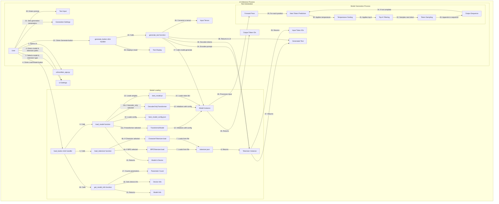

# Mini LLM Technical Flow Documentation

This document provides detailed technical flow diagrams showing exactly how data moves through the system during both training and inference processes.

## Training Flow Diagram

The diagram below illustrates the complete data flow during the training process, from initial file upload to model saving:

```mermaid
flowchart TD
    %% Training Flow Diagram
    subgraph "Training Process"
        A[User] -->|1. Provides data file| B[main.py]
        B -->|2. Calls| C[training/trainer.py]
        
        subgraph "Data Processing"
            C -->|3. Loads data| D[training/data_utils.py]
            D -->|4. Reads file| E[Raw Text Data]
            E -->|5. Splits into samples| F[Text Samples]
            F -->|6. Splits into train/val/test| G[Dataset Splits]
        end
        
        subgraph "Tokenization"
            C -->|7. Creates tokenizer| H[tokenizers/]
            H -->|8a. If BPE selected| I[tokenizers/bpe_tokenizer.py]
            H -->|8b. If Character selected| J[tokenizers/character_tokenizer.py]
            I -->|9a. Learns vocabulary| K[Tokenizer Training]
            J -->|9b. Creates character map| K
            K -->|10. Saves tokenizer| L[tokenizer.json]
            G -->|11. Tokenizes text| K
            K -->|12. Returns| M[Tokenized Sequences]
        end
        
        subgraph "Model Creation"
            C -->|13. Creates model| N[models/]
            N -->|14a. If transformer selected| O[models/transformer_model.py:TransformerModel]
            N -->|14b. If decoder_only selected| P[models/transformer_model.py:DecoderOnlyTransformer]
            O & P -->|15. Initializes with config| Q[Model Instance]
        end
        
        subgraph "Training Loop"
            C -->|16. Starts training loop| R[Training Loop]
            M -->|17. Batches data| S[DataLoader]
            S -->|18. Feeds batches| R
            R -->|19. Forward pass| Q
            Q -->|20. Computes loss| T[Loss Calculation]
            T -->|21. Backward pass| U[Gradient Calculation]
            U -->|22. Updates weights| Q
            R -->|23. Periodically evaluates| V[Validation]
            V -->|24. If best model| W[Save Checkpoint]
            W -->|25a. Saves model weights| X[best_model.pt]
            W -->|25b. Saves model config| Y[best_model_config.json]
        end
    end
```

## UI Inference Flow Diagram

The diagram below illustrates the complete data flow during the UI inference process, showing exactly which functions are triggered when generating output:

## Key Differences Between Model Types

### Transformer Model vs. Decoder-Only Model

1. **Transformer Model (Encoder-Decoder)**
   - Uses both encoder and decoder components
   - Encoder processes the entire input sequence
   - Decoder generates output tokens one by one
   - Suitable for sequence-to-sequence tasks (e.g., translation)
   - Implementation: `models/transformer_model.py:TransformerModel`

2. **Decoder-Only Model**
   - Uses only the decoder component
   - Processes input and generates output in a single stream
   - Uses causal attention mask to prevent looking at future tokens
   - Suitable for language modeling and text generation
   - Implementation: `models/transformer_model.py:DecoderOnlyTransformer`

### BPE Tokenizer vs. Character Tokenizer

1. **BPE (Byte Pair Encoding) Tokenizer**
   - Learns subword units from training data
   - Starts with characters and merges common pairs
   - Creates vocabulary of variable-length tokens
   - Better for handling unknown words and morphology
   - Implementation: `tokenizers/bpe_tokenizer.py`

2. **Character Tokenizer**
   - Uses individual characters as tokens
   - Simple and doesn't require training
   - Larger sequence lengths for same text
   - Better for languages with limited character sets
   - Implementation: `tokenizers/character_tokenizer.py`

## Data Flow Details

### Training Data Flow

1. **Data Loading**
   - Raw text file is read from disk
   - Text is split into samples (documents/paragraphs)
   - Samples are split into train/validation/test sets

2. **Tokenization**
   - Tokenizer is created based on selected type
   - Tokenizer is trained on the training data
   - Text samples are converted to token IDs
   - Special tokens are added (BOS, EOS, PAD)
   - Attention masks are created

3. **Model Training**
   - Model is initialized with configuration
   - Data is batched and fed to the model
   - Forward pass computes predictions
   - Loss is calculated by comparing with shifted input
   - Backward pass computes gradients
   - Optimizer updates model weights
   - Process repeats for specified number of epochs

4. **Checkpointing**
   - Model is periodically evaluated on validation set
   - If performance improves, model is saved
   - Both model weights and configuration are saved

### UI Inference Data Flow

1. **Model Loading**
   - User selects model and tokenizer types
   - User provides paths to model and tokenizer files
   - Tokenizer is loaded from JSON file
   - Model configuration is loaded from JSON file
   - Model is initialized with configuration
   - Model weights are loaded from checkpoint file

2. **Text Generation**
   - User enters prompt text
   - User sets generation parameters
   - Prompt is tokenized into token IDs
   - Token IDs are converted to tensor
   - Model generates output tokens one by one:
     - Process input through model layers
     - Predict probability distribution for next token
     - Apply temperature to adjust distribution
     - Apply top-k filtering to limit options
     - Sample next token from distribution
     - Append token to output sequence
     - Repeat until max length or EOS token
   - Output tokens are decoded back to text
   - Generated text is displayed to user

This documentation provides a comprehensive view of how data flows through the Mini LLM system during both training and inference processes.
