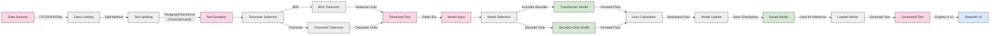

```mermaid
flowchart LR
    %% Data Sources
    DataSources["Data Sources"] --> |TXT/PDF/HTML| DataLoading["Data Loading"]
    
    %% Data Loading Process
    DataLoading --> |Split Method| TextSplitting["Text Splitting"]
    TextSplitting --> |Paragraph/Sentence/\nChunk/Semantic| TextSamples["Text Samples"]
    
    %% Tokenization Paths
    TextSamples --> TokenizerSelection["Tokenizer Selection"]
    TokenizerSelection --> |BPE| BPETokenizer["BPE Tokenizer"]
    TokenizerSelection --> |Character| CharTokenizer["Character Tokenizer"]
    
    %% Tokenization Process
    BPETokenizer --> |Subword Units| TokenizedText["Tokenized Text"]
    CharTokenizer --> |Character Units| TokenizedText
    TokenizedText --> |Token IDs| ModelInput["Model Input"]
    
    %% Model Selection
    ModelInput --> ModelSelection["Model Selection"]
    ModelSelection --> |Encoder-Decoder| TransformerModel["Transformer Model"]
    ModelSelection --> |Decoder Only| DecoderModel["Decoder-Only Model"]
    
    %% Training Process
    TransformerModel --> |Forward Pass| Loss["Loss Calculation"]
    DecoderModel --> |Forward Pass| Loss
    Loss --> |Backward Pass| ModelUpdate["Model Update"]
    ModelUpdate --> |Save Checkpoint| SavedModel["Saved Model"]
    
    %% Inference Process
    SavedModel --> |Load for Inference| LoadedModel["Loaded Model"]
    LoadedModel --> |Generate Text| Output["Generated Text"]
    
    %% UI Process
    Output --> |Display in UI| StreamlitUI["Streamlit UI"]
    
    %% Color coding
    classDef dataNode fill:#f9d5e5,stroke:#333,stroke-width:1px
    classDef processNode fill:#eeeeee,stroke:#333,stroke-width:1px
    classDef modelNode fill:#d5e8d4,stroke:#333,stroke-width:1px
    classDef outputNode fill:#dae8fc,stroke:#333,stroke-width:1px
    
    class DataSources,TextSamples,TokenizedText,ModelInput,Output dataNode
    class DataLoading,TextSplitting,TokenizerSelection,BPETokenizer,CharTokenizer,ModelSelection,Loss,ModelUpdate,LoadedModel processNode
    class TransformerModel,DecoderModel,SavedModel modelNode
    class StreamlitUI outputNode
```
