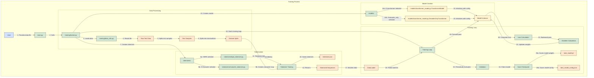

```mermaid
flowchart TD
    %% Training Flow Diagram
    subgraph "Training Process"
        A[User] -->|1. Provides data file| B[main.py]
        B -->|2. Calls| C[training/trainer.py]
        
        subgraph "Data Processing"
            C -->|3. Loads data| D[training/data_utils.py]
            D -->|4. Reads file| E[Raw Text Data]
            E -->|5. Splits into samples| F[Text Samples]
            F -->|6. Splits into train/val/test| G[Dataset Splits]
        end
        
        subgraph "Tokenization"
            C -->|7. Creates tokenizer| H[tokenizers/]
            H -->|8a. If BPE selected| I[tokenizers/bpe_tokenizer.py]
            H -->|8b. If Character selected| J[tokenizers/character_tokenizer.py]
            I -->|9a. Learns vocabulary| K[Tokenizer Training]
            J -->|9b. Creates character map| K
            K -->|10. Saves tokenizer| L[tokenizer.json]
            G -->|11. Tokenizes text| K
            K -->|12. Returns| M[Tokenized Sequences]
        end
        
        subgraph "Model Creation"
            C -->|13. Creates model| N[models/]
            N -->|14a. If transformer selected| O[models/transformer_model.py:TransformerModel]
            N -->|14b. If decoder_only selected| P[models/transformer_model.py:DecoderOnlyTransformer]
            O & P -->|15. Initializes with config| Q[Model Instance]
        end
        
        subgraph "Training Loop"
            C -->|16. Starts training loop| R[Training Loop]
            M -->|17. Batches data| S[DataLoader]
            S -->|18. Feeds batches| R
            R -->|19. Forward pass| Q
            Q -->|20. Computes loss| T[Loss Calculation]
            T -->|21. Backward pass| U[Gradient Calculation]
            U -->|22. Updates weights| Q
            R -->|23. Periodically evaluates| V[Validation]
            V -->|24. If best model| W[Save Checkpoint]
            W -->|25a. Saves model weights| X[best_model.pt]
            W -->|25b. Saves model config| Y[best_model_config.json]
        end
    end

    %% Color coding
    classDef userAction fill:#d0e0ff,stroke:#333,stroke-width:1px
    classDef dataFile fill:#ffe6cc,stroke:#333,stroke-width:1px
    classDef process fill:#d5e8d4,stroke:#333,stroke-width:1px
    classDef model fill:#fff2cc,stroke:#333,stroke-width:1px
    
    class A userAction
    class E,F,G,L,M,S,X,Y dataFile
    class B,C,D,H,I,J,K,N,R,T,U,V,W process
    class O,P,Q model
```
