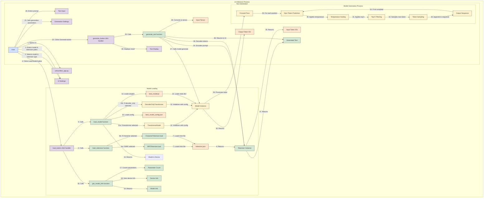

```mermaid
flowchart TD
    %% UI Inference Flow Diagram
    subgraph "UI Inference Process"
        A[User] -->|1. Opens UI| B[ui/rewritten_app.py]
        A -->|2. Selects model & tokenizer type| C[UI Settings]
        A -->|3. Enters model & tokenizer paths| C
        A -->|4. Clicks Load Model button| D[load_button click handler]
        
        subgraph "Model Loading"
            D -->|5. Calls| E[load_tokenizer function]
            E -->|6a. If BPE selected| F[BPETokenizer.load]
            E -->|6b. If Character selected| G[CharacterTokenizer.load]
            F & G -->|7. Loads from file| H[tokenizer.json]
            H -->|8. Returns| I[Tokenizer Instance]
            
            D -->|9. Calls| J[load_model function]
            J -->|10. Loads config| K[best_model_config.json]
            J -->|11a. If transformer selected| L[TransformerModel]
            J -->|11b. If decoder_only selected| M[DecoderOnlyTransformer]
            L & M -->|12. Initializes with config| N[Model Instance]
            J -->|13. Loads weights| O[best_model.pt]
            O -->|14. Loads state dict| N
            J -->|15. Returns| P[Model & Device]
            
            D -->|16. Calls| Q[get_model_info function]
            Q -->|17. Counts parameters| R[Parameter Count]
            Q -->|18. Gets device info| S[Device Info]
            Q -->|19. Returns| T[Model Info]
        end
        
        subgraph "Text Generation"
            A -->|20. Enters prompt| U[Text Input]
            A -->|21. Sets generation parameters| V[Generation Settings]
            A -->|22. Clicks Generate button| W[generate_button click handler]
            
            W -->|23. Calls| X[generate_text function]
            X -->|24. Encodes prompt| I
            I -->|25. Returns| Y[Input Token IDs]
            X -->|26. Converts to tensor| Z[Input Tensor]
            X -->|27. Calls model.generate| N
            
            subgraph "Model Generation Process"
                N -->|28. Processes input| AA[Forward Pass]
                AA -->|29. For each position| AB[Next Token Prediction]
                AB -->|30. Applies temperature| AC[Temperature Scaling]
                AC -->|31. Applies top-k| AD[Top-K Filtering]
                AD -->|32. Samples next token| AE[Token Sampling]
                AE -->|33. Appends to sequence| AF[Output Sequence]
                AF -->|34. If not complete| AB
            end
            
            N -->|35. Returns| AG[Output Token IDs]
            X -->|36. Decodes tokens| I
            I -->|37. Returns| AH[Generated Text]
            X -->|38. Returns to UI| AH
            W -->|39. Displays result| AI[Text Display]
        end
    end

    %% Color coding
    classDef userAction fill:#d0e0ff,stroke:#333,stroke-width:1px
    classDef uiElement fill:#e1d5e7,stroke:#333,stroke-width:1px
    classDef dataFile fill:#ffe6cc,stroke:#333,stroke-width:1px
    classDef process fill:#d5e8d4,stroke:#333,stroke-width:1px
    classDef model fill:#fff2cc,stroke:#333,stroke-width:1px
    
    class A userAction
    class B,C,D,U,V,W,AI uiElement
    class H,K,O,Y,Z,AG dataFile
    class E,F,G,I,J,Q,X process
    class L,M,N,AA,AB,AC,AD,AE,AF model
    class R,S,T,AH process
```
